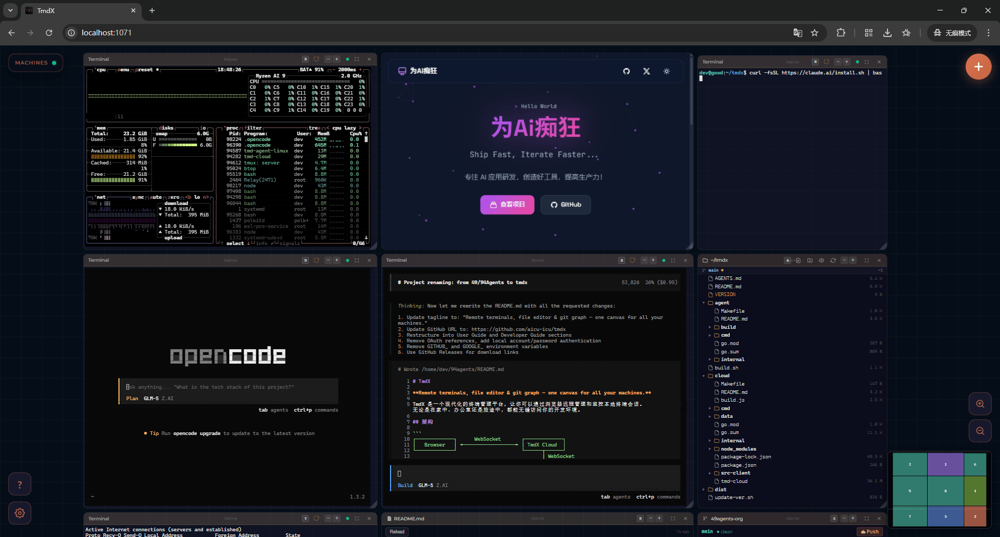

[English](README.md) | 中文

# TmdX

**Remote terminals, file editor & git graph — one canvas for all your machines.**



TmdX 是一个终端管理平台，通过浏览器远程管理终端会话。随时随地访问你的开发环境。

## 架构

```
┌─────────────┐      WebSocket       ┌─────────────┐
│   Browser   │ ◄──────────────────► │ TmdX Cloud  │
└─────────────┘                      └──────┬──────┘
                                            │ WebSocket
                                     ┌──────▼──────┐
                                     │ TmdX Agent  │
                                     └──────┬──────┘
                                            │
                                     ┌──────▼──────┐
                                     │   tmux/PTY  │
                                     └─────────────┘
```

## 功能特性

- **终端管理**: tmux 持久化会话、实时同步、分屏布局
- **文件编辑**: 浏览、创建、删除、重命名；Monaco Editor 语法高亮
- **Git 图表**: 仓库扫描与可视化
- **系统监控**: CPU、内存、GPU 指标；Claude 状态检测
- **多用户**: 本地认证，首个用户自动成为管理员
- **离线可用**: 前端资源完全本地化，无 CDN 依赖

## 快速开始

### 1. 部署 Cloud

在 Linux 服务器下载并运行：

```bash
curl -fsSL https://github.com/aicu-icu/tmdx/releases/latest/download/tmd-cloud-linux-amd64 -o tmd-cloud
chmod +x tmd-cloud
./tmd-cloud
```

Cloud 会：
- 创建 `data/` 目录存放数据库
- 默认监听 `1071` 端口

### 2. 访问 Web UI

浏览器打开 `http://your-server:1071`：

1. 注册 / 登录
2. 点击「添加 Agent」
3. 选择平台，复制配置命令

### 3. 安装 Agent

在本地机器执行：

```bash
# 下载（URL 从 Web UI 复制）
curl -fsSL <download-url> -o tmd-agent
chmod +x tmd-agent

# 配置（命令从 Web UI 复制）
./tmd-agent config ws://your-server:1071@<token>

# 启动
./tmd-agent start
```

完成！刷新 Web UI 即可看到你的机器。

## 命令

```bash
./tmd-agent start          # 前台启动
./tmd-agent start --daemon # 后台启动
./tmd-agent status         # 查看状态
./tmd-agent stop           # 停止
./tmd-agent install-service # 系统服务安装
```

## 技术栈

- **Agent**: Go, gorilla/websocket, creack/pty
- **Cloud**: Go, gin-gonic/gin, modernc.org/sqlite
- **Frontend**: 原生 JS, Monaco Editor, Marked.js

## 文档

- [开发指南](docs/README.dev.zh.md) - 构建、开发、项目结构

## 致谢

本项目参考 [49Agents](https://github.com/49Agents/49Agents) 重构而来。

## License

MIT License
